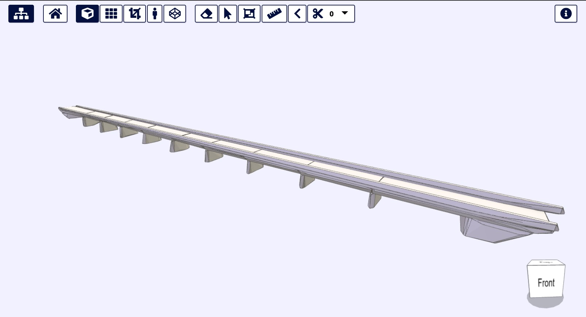
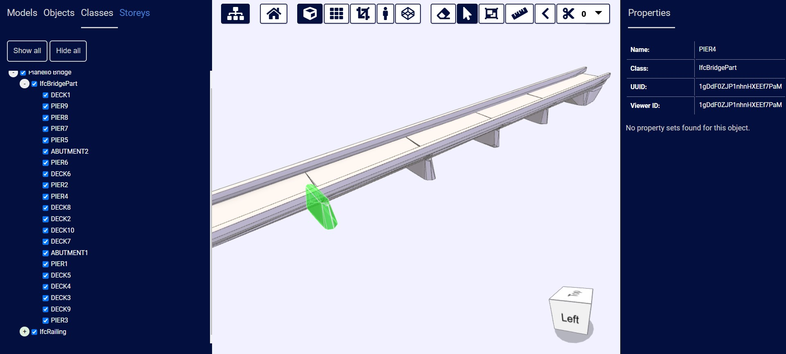
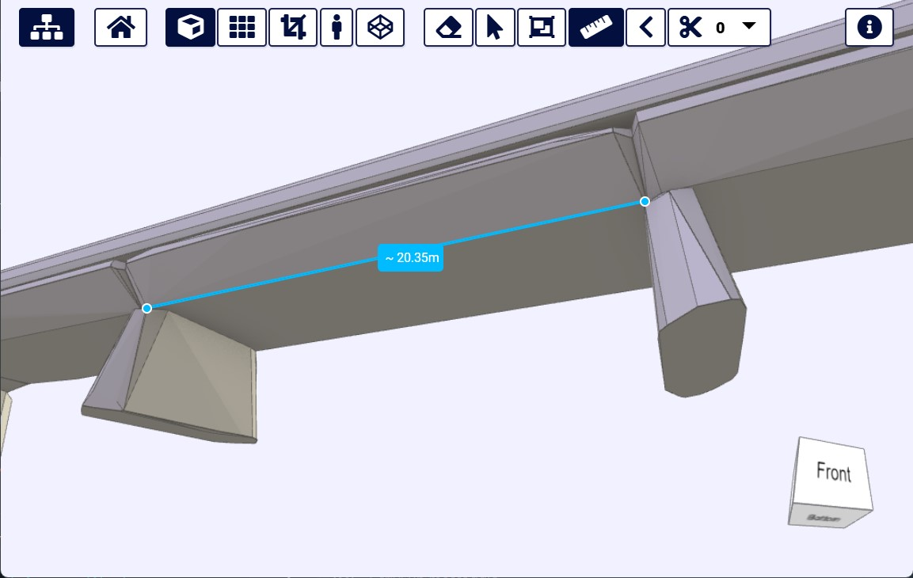

# Bridge-IT-BIM

*Test for viewing BIM data on the web.*

This repository contains the source-code of the xeokit BIM viewer instance implemented for the case study of the Pianello bridge, a structure located in the Province of Piacenza (Italy) and surveyed for an ordinary inspection in 2024.

## Features

The native functionalities of the xeokit-BIM-Viewer allow for interactive and flexible exploration of the resulting IFC representation of the Pianello bridge.

In particular, with simple clicks, users can inspect specific classes associated to bridge structural elements, also deciding weather to highlight or hide specific portions. Additionally, from the sidebar of the classes, it is possible to select more specifically the feature of interest also considering the hierarchical structure of the structure.

Additional features of the Viewer include the possibility to execute measurements of distances and angles directly on the solid geometry of the model. The possibility to extract cross-section along preferred axis is made available too.

A working example ready to be explored can be found online on the [LabMGF website](https://labmgf.dica.polimi.it/piacenzacs/bridge-it-bim/index.html?projectId=pianello).

## How to install and run

Make sure you have the following installed and working in order to reproduce the project locally. You can view detailed installation guidelines within the following links:

* [Xampp / Apache server](https://www.apachefriends.org/index.html)
* [Github to clone project](https://git-scm.com/downloads)

Once you cloned this repository, make sure that it is located inside the xampp/htdocs directory. The web app will then be accessible by connecting to the url localhost/bridge-it-bim/.

## License

For continuity sake, this project carries the same license as the original *[xeokit-BIM-Viewer](https://github.com/xeokit/xeokit-bim-viewer)* project by xeolabs. More information can be found in the [LICENSE](LICENSE.txt) file.

## Performance

The example work best with Google Chrome and Firefox.

## Data

The model explorable on the working example and shared in this repository in .xkt + .json formats is the results of the processing of data collected during a field survey aimed at documenting the actual condition of the bridge. This operation implied the adoption of photogrammetry, laser scanning, GNSS measuring and traditional topographic network adjustment. The classification and conversion in IFC of the resulting integrated point cloud were executed with a semi-automated approach (ref. to be shared soon)

## References

[...]